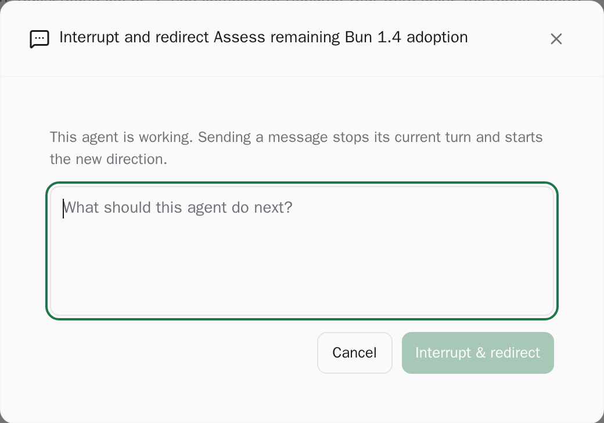

# paseo-agent-team

Define reusable Roles, compose them into Teams, and launch a cross-harness agent
crew from the Paseo UI. The plugin keeps the original Agent Crew Explorer panel
and adds Role / Team labels on agents this plugin creates.

Paseo Agent Profiles stay the execution config (provider, model, mode, thinking,
features). Roles own the identity, mission, restrictions, and **system prompt**.
Teams pick a coordinator Role plus members. Launch creates every member up front
with a real system prompt, parent relationship, and `agent-team.*` labels.

## Screenshots

Names, workspaces, and task details in these screenshots are synthetic. The rendered page was
rewritten before capture so no private project or session identifiers are published.

### Crew overview


### Safe action confirmation



## Install

Paseo plugins are trusted, unsandboxed code. Review the source before installing it.

From GitHub:

```bash
paseo plugin add Mason-x/paseo-agent-team:paseo-agent-team
```

From a local checkout on the Paseo daemon host:

```bash
git clone https://github.com/Mason-x/paseo-agent-team.git
cd paseo-agent-team/paseo-agent-team
npm ci
paseo plugin install "$PWD"
```

Open **Agent Teams** in the sidebar to create Roles and Teams. Open a workspace,
choose **New tab** in Explorer, then select **Agent Crew**. The **Open Agent Crew**
and **Launch agent team** Command Center actions open the panel directly.

## Configure

1. Create at least one Paseo Agent Profile per provider you want on a team
   (**Settings → Agents / Profiles**). This plugin only stores Profile ids.
2. Open **Agent Teams → Roles**. Create a Role or import the example Coding and
   Research teams when the catalog is empty.
3. Bind each Role to a preferred Profile (and optional fallbacks). Missing
   Profiles are marked; they are never silently replaced.
4. Open **Teams**. Choose a coordinator Role and at least one member Role.
   Duplicate Roles need an `instanceLabel` (for example Backend / Frontend).

## Launch

From a workspace: **Agent Crew → Launch team**, or Command Center **Launch agent
team**. From **Agent Teams**, use a team's **Launch** button and pick the
workspace.

Preview shows the resolved Profile and source (member override, preferred, or
fallback) plus warnings and blockers. Launch is disabled while blockers remain.

After confirm, the plugin creates the coordinator, then each member as a child,
then sends the coordinator a kickoff message with the roster. Members stay idle
until the coordinator uses `send_agent_prompt`.

## Limits

- Requires Paseo `>=0.8.0` (0.8.x and 0.9, including prereleases such as
  `0.9.0-beta.2`). It uses only the public plugin SDK. The 0.8.0
  `paseo-plugin.json` schema is strict and accepts only `id`, `requirements`,
  and `build` — not `description` (that field arrives in later Paseo versions).
- Roles and Teams are host-scoped settings. Every client on that daemon shares
  them. There is no per-workspace catalog in v1.
- Default member cap is 8 (hard cap 16). Members are created up front.
- `create_agent` inside a harness cannot set `systemPrompt` or a Profile. This
  plugin therefore pre-creates members instead of letting the coordinator spawn
  them.
- Tool-level deny lists are not available in Paseo 0.8.0. Put limits in Role
  restrictions text. Coordinators are instructed never to call
  `respond_to_permission`.
- Native provider subagents are not shown in Crew Tree.
- Sending to a running agent interrupts its active turn.

## Compatibility

Known Paseo 0.9 differences (additive; this plugin still typechecks against 0.8.0):

- `registerSettings` returns a `{ read, subscribe }` handle instead of `void`.
- `navigation.openAgent` / `openWorkspace` accept `serverId`.
- New client helpers: `useHosts`, `getPaseoClient`, `openExternalUrl`,
  `ExternalLink`, `navigation.openBrowser`.
- Provider events include `toolCallId`.
- Nested provider subagent parent relationships are corrected.

`npm run typecheck:next` installs `@getpaseo/{plugin,client,protocol}@next` and
typechecks. Treat failures as recorded differences until 0.9 is verified.

## Crew Tree

The Explorer panel is the original Agent Crew UI:

- Every non-archived managed agent in the current workspace, organized into
  orchestration trees, including managed descendants in other workspaces.
- Status filters, search, Nudge, Redirect, Detach, Archive, and explicit
  permission Allow / Deny.
- Agents launched by this plugin also show `{role} · {team}` from labels, even
  if the Role definition was later deleted.

Ordinary Paseo agents that this plugin did not create are unchanged.

## Develop

Follow `AGENTS.md`. Never point plugin lifecycle commands at the default Paseo
home.

```bash
npm ci
npm run check
npm test
npm run test:coverage
npm run typecheck
```

The project pins `@getpaseo/cli`, `@getpaseo/client`, `@getpaseo/plugin`, and
`@getpaseo/protocol` to stable `0.8.0`. React 19.1 and React Native 0.81 match
the host.

See `UPSTREAM.md` for the Agent Crew import commit.

Release Please maintains versions, changelog entries, component tags, and GitHub
releases from Conventional Commits in the monorepo.
